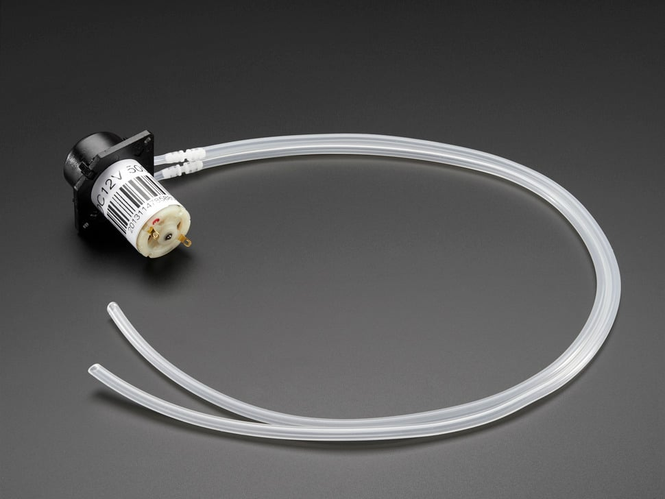
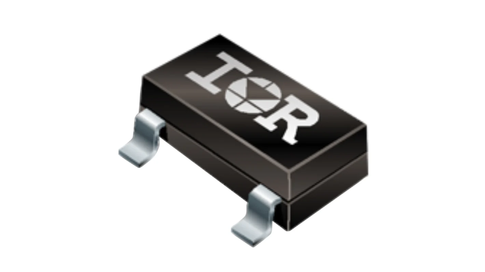

**Water Pump**

1. Peristaltic Liquid Pump with Silicone Tubing - 12V DC Power

     

    - **Price:** $24
    - **Product:** [Link to product](https://www.adafruit.com/product/1150?srsltid=AfmBOooaz39uHHWJ213ik0FwD3iclTX2l7PiEKJ8JLTGcDD_krnj78P4)

    | Pros                                      | Cons                                                             |
    | ----------------------------------------- | ---------------------------------------------------------------- |
    | Better and more reliable water flow       | Rated for 12V instead of a lower 3.3 or 5V                       |
    | Easy to use and beginner friendly         | Possible durability concerns                                    |
    | Meets through hole constraint of project  | Expensive component                                   |

    
2. 	SUBMERSIBLE 3VDC HORIZONTAL PUMP

     

    - **Price:** $2.95
    - **Product:** [Link to product](https://www.digikey.com/en/products/detail/adafruit-industries-llc/4546/11627740)

    | Pros                                                              | Cons                |
    | ----------------------------------------------------------------- | ------------------- |
    | Extremely cheap component                                         | More expensive      |
    | Low voltage rating of 3V                                          | Slow shipping speed |
    | Meets through hole constraint of project                          | Low water flow      |
    | Able to be submersed                                              | Must be submmersed  |

 3.  Peristaltic Liquid Pump with Silicone Tubing - 5V to 6V DC Power

    

    - **Price:** $24.95
    - **Product:** [Link to product](https://www.adafruit.com/product/3910?gad_source=1&gad_campaignid=21079267614&gbraid=0AAAAADx9JvQlcGTZYRF6TWY-XTRT3Qei7&gclid=Cj0KCQjwsPzHBhDCARIsALlWNG2GqUuxTrSHFR22KW7wy2Tp4dqZtKbyARlyKp5T1vI9AJeWGoFzRQcaAiygEALw_wcB)

    | Pros                                                              | Cons                |
    | ----------------------------------------------------------------- | ------------------- |
    | Favored by hobbyists                                              | Expensive           |
    | 5V rated                                                          | Maintenance needed  |
    | Meets through hole constraint of project                          |       
    | Good water flow                                                   |   

**Choice:** Option 3:  Peristaltic Liquid Pump with Silicone Tubing - 5V to 6V DC Power

**Rationale:** Although this component is pretty expensive compared to its counterparts, it is highly vetted by hobbyists and comes from a reliable site with quick delivery times, we are hoping the extra cost can fix some of the grievences about existing products on the market with water pumps with noise and durability being the two most common problems. 

**MOSFET**

1. AO3400A Alpha and Omega Semiconductor 

 

- **Price:** $0.46  
- **Product:** [AO3400A – Alpha & Omega Semiconductor Inc.](https://www.digikey.com/en/products/detail/alpha-omega-semiconductor-inc/AO3400A/1855772)

| Pros                                 | Cons                                         |
| ------------------------------------ | -------------------------------------------- |
| Very cheap component                 | Possible stall currents                      |
| Low heat draw                        | Possible durability concerns                 |
| Meets through-hole constraint of project | —                                          |

    
2. 	IRLML2502 Infineon

     

    - **Price:** $0.45
    - **Product:** [Link to product](https://www.infineon.com/part/IRLML2502)

    | Pros                                                              | Cons                |
    | ----------------------------------------------------------------- | ------------------- |
    | Highly vetted                                                     | High heat           |
    | Consistent and reliable                                           |  
    | Meets through hole constraint of project                          |                     
    | Quick shipping times                                              |   

 3.  IRLML6344 Infineon

    

    - **Price:** $0.49
    - **Product:** [Link to product](https://www.infineon.com/part/IRLML6344)

    | Pros                                                              | Cons                |
    | ----------------------------------------------------------------- | ------------------- |
    | Highly vetted                                                     | High heat           |
    | Consistent and reliable                                           |  
    | Meets through hole constraint of project                          |       
    | Quick shipping times

**Choice:** Option 1:   AO3400A Alpha and Omega Semiconductor 

**Rationale:** Team 106 is open to trying multiple MOSFETS since the low cost and speedy shipping times the AO3400A seems to be the favorite among hobbyists with similar constraints to our project 

