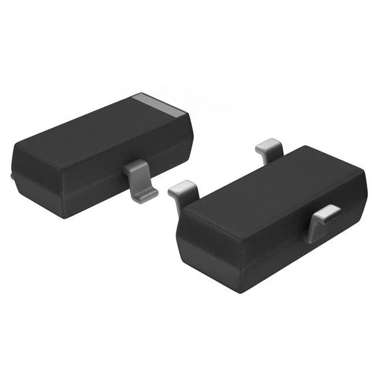
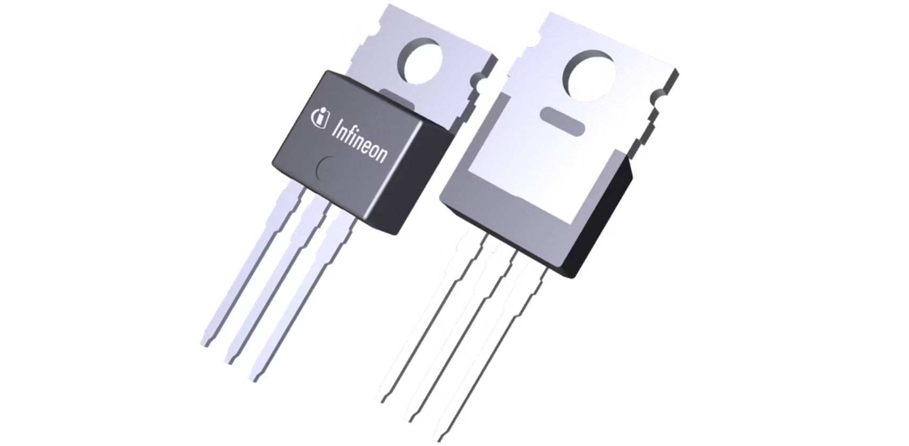
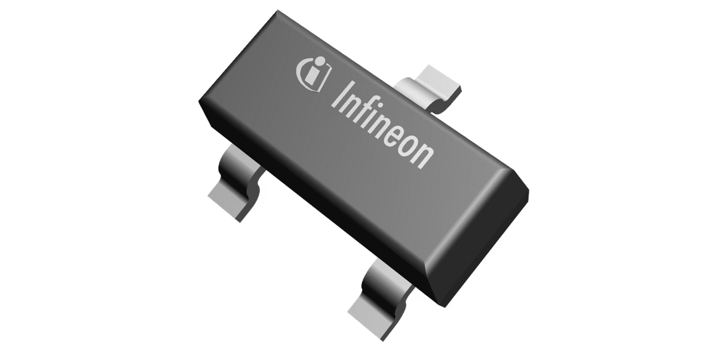

**Water Pump**

1. Hiwonder Water pump

     

    - **Price:** $7.99
    - **Product:** [Link to product](https://www.hiwonder.com/products/water-pump-module?variant=39371234345047&country=US&currency=USD&utm_medium=product_sync&utm_source=google&utm_content=sag_organic&utm_campaign=sag_organic&srsltid=AfmBOorb_kTUpsCL694XiuvM-Vl92MBrY7hTJsFCmJMT7moRs3hR-3N72Wg&com_cvv=8fb3d522dc163aeadb66e08cd7450cbbdddc64c6cf2e8891f6d48747c6d56d2c)

    | Pros                                      | Cons                                                             |
    | ----------------------------------------- | ---------------------------------------------------------------- |
    | Better and more reliable water flow       |       Possible durability concerns                 |
    | Easy to use and beginner friendly         |                                     |
    | Meets through hole constraint of project  |                                    |

    
2. 	SUBMERSIBLE 3VDC HORIZONTAL PUMP

     

    - **Price:** $2.95
    - **Product:** [Link to product](https://www.digikey.com/en/products/detail/adafruit-industries-llc/4546/11627740)

    | Pros                                                              | Cons                |
    | ----------------------------------------------------------------- | ------------------- |
    | Extremely cheap component                                         | More expensive      |
    | Low voltage rating of 3V                                          | Slow shipping speed |
    | Meets through hole constraint of project                          | Low water flow      |
    | Able to be submersed                                              | Must be submmersed  |

 3.  Peristaltic Liquid Pump with Silicone Tubing - 5V to 6V DC Power

    

    - **Price:** $24.95
    - **Product:** [Link to product](https://www.adafruit.com/product/3910?gad_source=1&gad_campaignid=21079267614&gbraid=0AAAAADx9JvQlcGTZYRF6TWY-XTRT3Qei7&gclid=Cj0KCQjwsPzHBhDCARIsALlWNG2GqUuxTrSHFR22KW7wy2Tp4dqZtKbyARlyKp5T1vI9AJeWGoFzRQcaAiygEALw_wcB)

    | Pros                                                              | Cons                |
    | ----------------------------------------------------------------- | ------------------- |
    | Favored by hobbyists                                              | Expensive           |
    | 5V rated                                                          | Maintenance needed  |
    | Meets through hole constraint of project                          |       
    | Good water flow                                                   |   

**Choice:** Option 3:  Peristaltic Liquid Pump with Silicone Tubing - 5V to 6V DC Power

**Rationale:** Although this component is pretty expensive compared to its counterparts, it is highly favored by hobbyists and comes from a reliable site with quick delivery times, we are hoping the extra cost can fix some of the grievences about existing products on the market with water pumps with noise and durability being the two most common problems. With this type of water pump the liquid is only touching the tubing instead of the pump internals extending durability and reducing noise.  

**MOSFET**

1. AO3400A Alpha and Omega Semiconductor 

 

- **Price:** $0.46  
- **Product:** [AO3400A – Alpha & Omega Semiconductor Inc.](https://www.digikey.com/en/products/detail/alpha-omega-semiconductor-inc/AO3400A/1855772)

| Pros                                 | Cons                                         |
| ------------------------------------ | -------------------------------------------- |
| Very cheap component                 | Possible stall currents                      |
| Low heat draw                        | Possible durability concerns                 |
|                                      | Is a surface mount Component 

    
2. 	IRLZ44N Infineon

     

    - **Price:** $1.52
    - **Product:** [Link to product](https://www.infineon.com/part/IRLZ44N)

    | Pros                                                              | Cons                |
    | ----------------------------------------------------------------- | ------------------- |
    | Overkill for project                                              | High heat           |
    | Consistent and reliable                                           | Expensive           |
    | Meets through hole constraint of project                          |                     
    | Quick shipping times                                              |   

 3.  IRLML6344 Infineon

    

    - **Price:** $0.49
    - **Product:** [Link to product](https://www.infineon.com/part/IRLML6344)

    | Pros                                                              | Cons                |
    | ----------------------------------------------------------------- | ------------------- |
    | Highly favored                                                    | High heat           |
    | Consistent and reliable                                           | Surface Mount
    

**Choice:** Option 2:  IRLZ44N Infineon

**Rationale:** The PIC microcontroller cannot safely power the pump directly so a MOSFET is needed. The MOSFET switches the 5-6V supply on and off rapidly with a PWM signal to control speed and water flow. The IRLZ44N is a good choice here because it can safely handle the pumps motor current without overheating or damaging the microcontroller this meets project constraints by coming in through hole configuration, working directly with 3.3V or 5V microcontroller signals and has a great safety margin for our project outputting virtually no heat.

