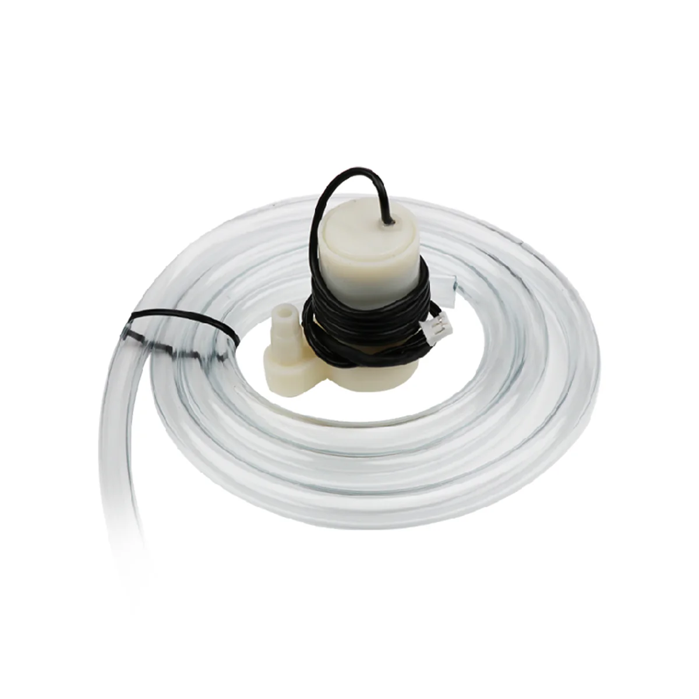
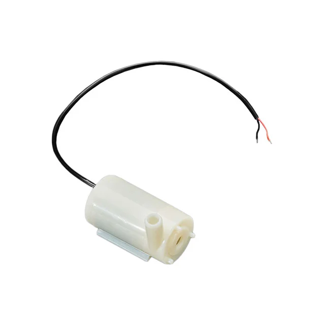
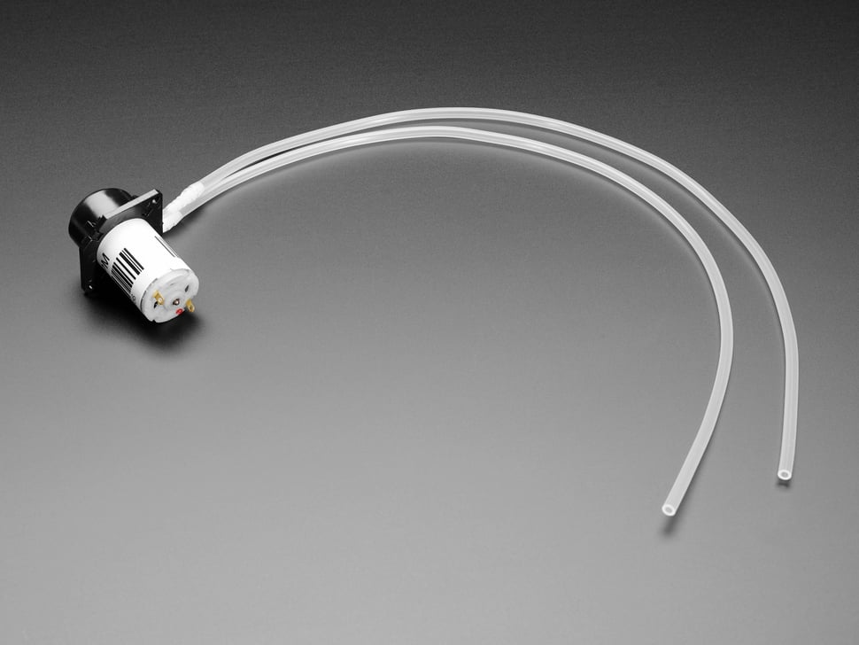
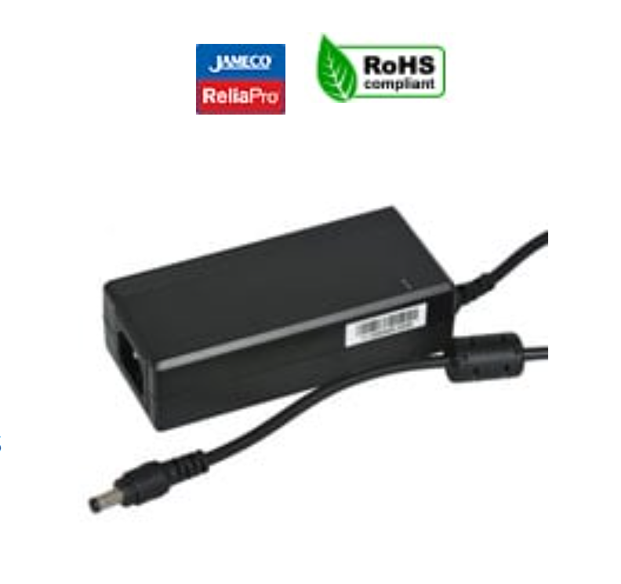
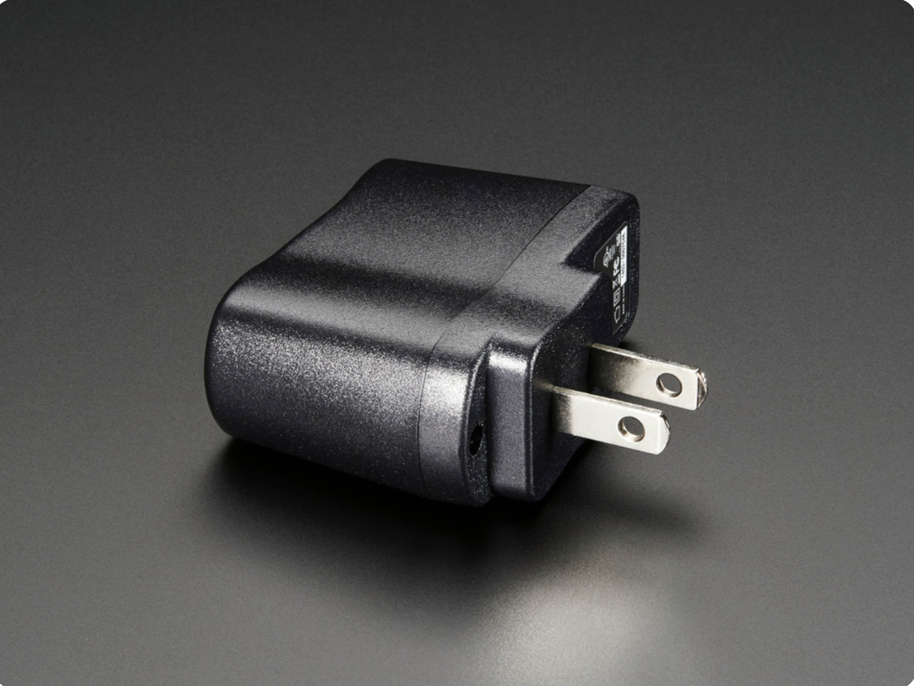
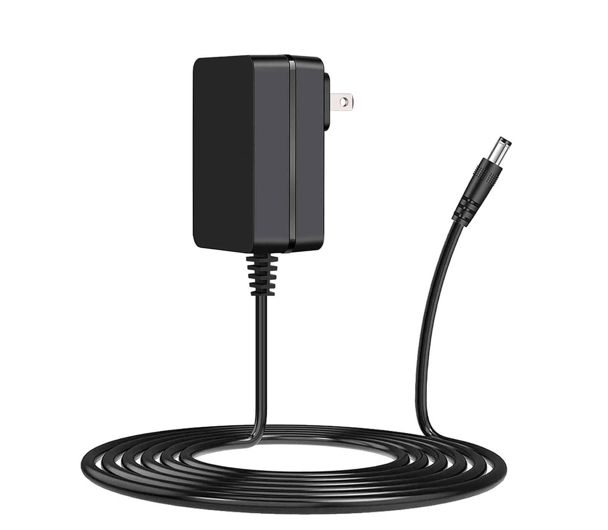

**Water Pump**

1. Hiwonder Water pump

     

    - **Price:** $7.99
    - **Product:** [Link to product](https://www.hiwonder.com/products/water-pump-module?variant=39371234345047&country=US&currency=USD&utm_medium=product_sync&utm_source=google&utm_content=sag_organic&utm_campaign=sag_organic&srsltid=AfmBOorb_kTUpsCL694XiuvM-Vl92MBrY7hTJsFCmJMT7moRs3hR-3N72Wg&com_cvv=8fb3d522dc163aeadb66e08cd7450cbbdddc64c6cf2e8891f6d48747c6d56d2c)

    | Pros                                      | Cons                                                             |
    | ----------------------------------------- | ---------------------------------------------------------------- |
    | Better and more reliable water flow       |       Possible durability concerns                 |
    | Easy to use and beginner friendly         |                                     |
    | Meets through hole constraint of project  |                                    |

    
2. 	SUBMERSIBLE 3VDC HORIZONTAL PUMP

     

    - **Price:** $2.95
    - **Product:** [Link to product](https://www.digikey.com/en/products/detail/adafruit-industries-llc/4546/11627740)

    | Pros                                                              | Cons                |
    | ----------------------------------------------------------------- | ------------------- |
    | Extremely cheap component                                         | More expensive      |
    | Low voltage rating of 3V                                          | Slow shipping speed |
    | Meets through hole constraint of project                          | Low water flow      |
    | Able to be submersed                                              | Must be submmersed  |

 3.  Peristaltic Liquid Pump with Silicone Tubing - 5V to 6V DC Power

    

    - **Price:** $24.95
    - **Product:** [Link to product](https://www.adafruit.com/product/3910?gad_source=1&gad_campaignid=21079267614&gbraid=0AAAAADx9JvQlcGTZYRF6TWY-XTRT3Qei7&gclid=Cj0KCQjwsPzHBhDCARIsALlWNG2GqUuxTrSHFR22KW7wy2Tp4dqZtKbyARlyKp5T1vI9AJeWGoFzRQcaAiygEALw_wcB)

    | Pros                                                              | Cons                |
    | ----------------------------------------------------------------- | ------------------- |
    | Favored by hobbyists                                              | Expensive           |
    | 5V rated                                                          | Maintenance needed  |
    | Meets through hole constraint of project                          |       
    | Good water flow                                                   |   

**Choice:** Option 3:  Peristaltic Liquid Pump with Silicone Tubing - 5V to 6V DC Power

**Rationale:** Although this component is pretty expensive compared to its counterparts, it is highly favored by hobbyists and comes from a reliable site with quick delivery times, we are hoping the extra cost can fix some of the grievences about existing products on the market with water pumps with noise and durability being the two most common problems. With this type of water pump the liquid is only touching the tubing instead of the pump internals extending durability and reducing noise.  

**Power Supply**

1. 12 Volt 5 Amp power supply 

- **Price:** $13.95  
- **Product:** [Jameco 12V power supply](https://www.jameco.com/z/DCT65W120500ZZ-A2-Jameco-ReliaPro-12-Volt-5-Amp-60-Watt-Regulated-Switching-Desktop-Power-Adapter_2208956.html2)

| Pros                                 | Cons                                         |
| ------------------------------------ | -------------------------------------------- |
| provides more than enough power to the system                 | Expensive                       |
| Will be able to use water pump to full extent                        | Possible heat concerns                 |
|                                      | 

    
2. 	5V 1A (1000mA) USB port power supply

    

    - **Price:** $5.95
    - **Product:** [Link to product](https://www.adafruit.com/product/501)

    | Pros                                                              | Cons                |
    | ----------------------------------------------------------------- | ------------------- |
    | extremely cheap                                              | Low power           |
    | Consistent and reliable                                           | USB instead of barrel jack           |
    |                           |                     
    |                                               |   

 3.  9V 3A

     

    - **Price:** $15.79
    - **Product:** [Link to product](https://www.walmart.com/ip/Guy-Tech-9V-3A-3000mA-5-5mmx2-1mm-5-5x2-1-AC-DC-Switching-Adapter-Power-Supply-Charger/6907270647?wmlspartner=wlpa&selectedSellerId=101347538)

    | Pros                                                              | Cons                |
    | ----------------------------------------------------------------- | ------------------- |
    | Middle of the road power and pricing                                                    | Water pump will be slightly weak           |
    | Consistent and reliable                                           | 
    

**Choice:** Option 3:  9v 3a

**Rationale:** The 9v 3a is the best choice here because one is already provided in our kit and provides enough power to power both the 6v gear motor and the 12v water pump, although the 12v water pump will not be powered to the full extent. 

**Voltage Regulator**

1. 5V 1.5A Linear Voltage Regulator - 7805 

  

- **Price:** $0.75  
- **Product:** [Link to product](https://www.adafruit.com/product/2164?srsltid=AfmBOorgiKzlhs3oY63HyqFvFEQKYdkGxO2YQP96WqwmzfRaBIdHGQin)

| Pros                                 | Cons                                         |
| ------------------------------------ | -------------------------------------------- |
| Very cheap component                 |                       |
| Low heat draw                        | Possible durability concerns                 |
|                                      | 

    

**Choice:** Option 1:  5V 1.5A Linear Voltage Regulator - 7805

**Rationale:** This is a perfect choice, it comes in the kit, the pic is powered by 5v and this will also be able to provide power to the 6v gear motor I am using.

