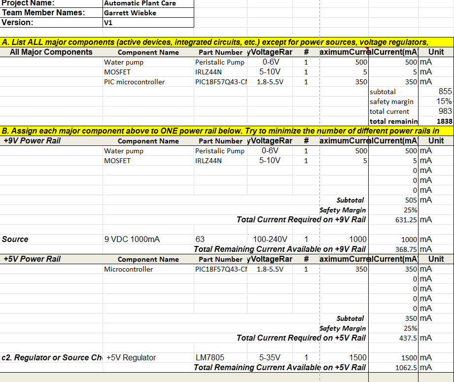
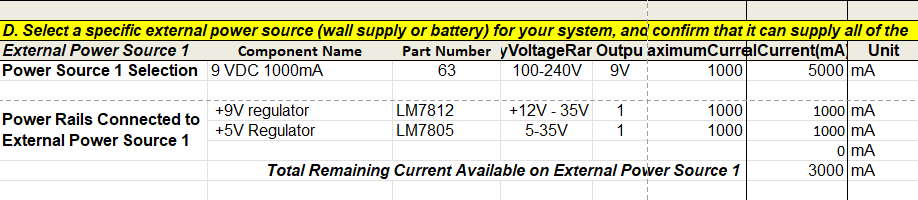

## Overview
By completing this power budget, the design team confirmed that the subsystem’s 9 V wall supply can safely power all components, with sufficient headroom. This step was essential for validating the system’s electrical reliability, efficiency, and safety, and for ensuring that future revisions or expansions will remain within acceptable power limits.

{style width:"350" height:"300;"}

{style width:"350" height:"300;"}

## Conclusions

In conclusion, the completed power budget confirms that the selected 9 V, 3 A wall adapter and LM7805 voltage regulator can adequately and safely supply all components of the smart plant watering system. The total estimated current draw, including a 25% safety margin, remains well below the regulator’s and power supply’s limits, ensuring stable operation. The PIC18F57Q43 Curiosity Nano, IRLZ44N MOSFET, and 5–6 V peristaltic pump each operate within their specified voltage and current ranges, validating the suitability of the 5 V power rail design. This analysis demonstrates that the system’s power architecture is both electrically reliable and energy-efficient, providing a solid foundation for consistent performance and scalability in future iterations of the project.

## Resouces

The power budget as a PDF download is available [*here*](Power Budget GW.pdf), and a Microsoft Excel Sheet [*here*](Power Budget GW.xlsx).